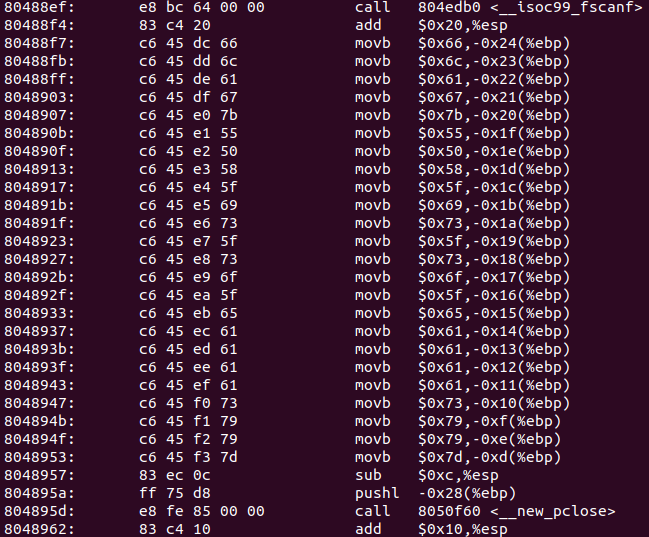

#### Getting Started

```bash
$ file getting-started
getting-started: ELF 32-bit LSB executable, Intel 80386, version 1 (SYSV), dynamically
linked, interpreter /lib/ld-linux.so.2, for GNU/Linux 2.6.32,
BuildID[sha1]=30a1e294daa93e231641dbe11a9501f87ed4a1c3, not stripped
$ strings getting-started
...
j}j1j_jljejvjejlj_jojtj_jejmjojcjljejwj{jgjajljf
...
```

Pay attention to the string just revealed. From the back, the alternate characters read `flag{welcome_to_level_1}`. 

#### Pure Luck

```sh
$ file pure-luck-initial.out
pure-luck-initial.out: ELF 32-bit LSB executable, Intel 80386, version 1 (GNU/Linux), statically linked, stripped
$ binwalk pure-luck.out
DECIMAL       HEXADECIMAL     DESCRIPTION
--------------------------------------------------------------------------------
0             0x0             ELF, 32-bit LSB executable, Intel 80386, version 1 (GNU/Linux)
273112        0x42AD8         Copyright string: "Copyright (C) 1996-2016 the UPX Team. All Rights Reserved. $"
```

At this point, I had to research a bit on what [upx](upx.io) is. It is a compression library. The easiest way to install it is

```sh
$ sudo apt update
$ sudo apt install upx-ucl
$ upx -d pure-luck.out
```

This decompresses the file. And gives us the `pure-luck.out` again.

```sh
$ objdump -d pure-luck.out | less
```

I searched for main and the following bit was a bit suspicious.



Some values are just being pushed into the stack. Checking those values reveal that the ascii values make

```sh
echo $'\x66\x6c\x61\x67\x7b\x55\x50\x58\x5f\x69\x73\x5f\x73\x6f\x5f\x65\x61\x61\x61\x61\x73\x79\x79\x7d'
flag{UPX_is_so_eaaaasyy}
```
