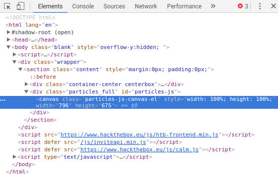
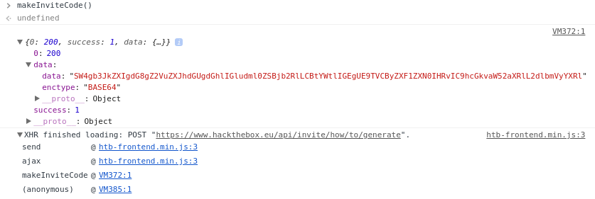

### To invite yourself to the website

Go to [https://hackthebox.eu/invite](https://www.hackthebox.eu/invite)

View the source code:



Note that there is a ```/js/inviteapi.min.js``` script. Navigate to that source.

```javascript
eval(function(p,a,c,k,e,d){e=function(c){return c.toString(36)};if(!''.replace(/^/,String)){while(c--){d[c.toString(a)]=k[c]||c.toString(a)}k=[function(e){return d[e]}];e=function(){return'\\w+'};c=1};while(c--){if(k[c]){p=p.replace(new RegExp('\\b'+e(c)+'\\b','g'),k[c])}}return p}('1 i(4){h 8={"4":4};$.9({a:"7",5:"6",g:8,b:\'/d/e/n\',c:1(0){3.2(0)},f:1(0){3.2(0)}})}1 j(){$.9({a:"7",5:"6",b:\'/d/e/k/l/m\',c:1(0){3.2(0)},f:1(0){3.2(0)}})}',24,24,'response|function|log|console|code|dataType|json|POST|formData|ajax|type|url|success|api|invite|error|data|var|verifyInviteCode|makeInviteCode|how|to|generate|verify'.split('|'),0,{}))
```

Note the ```makeInviteCode```. Call it.

 

Note that the ```data``` object is encoded with base64. Decode it:

```bash
echo SW4gb3JkZXIgdG8gZ2VuZXJhdGUgdGhlIGludml0ZSBjb2RlLCBtYWtlIGEgUE9TVCByZXF1ZXN0IHRvIC9hcGkvaW52aXRlL2dlbmVyYXRl | base64 --decode
```

This decodes to **In order to generate the invite code, make a POST request to /api/invite/generate**

Use curl to send the post request:

```bash
curl -i -X POST https://www.hackthebox.eu/api/invite/generate
```

