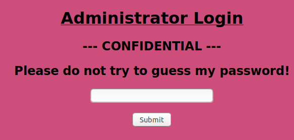
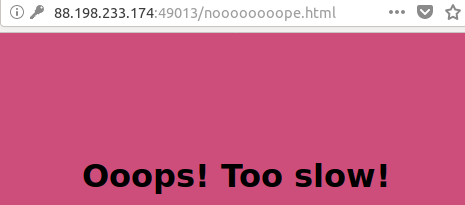
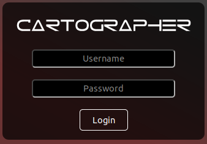
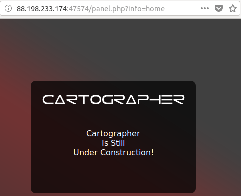
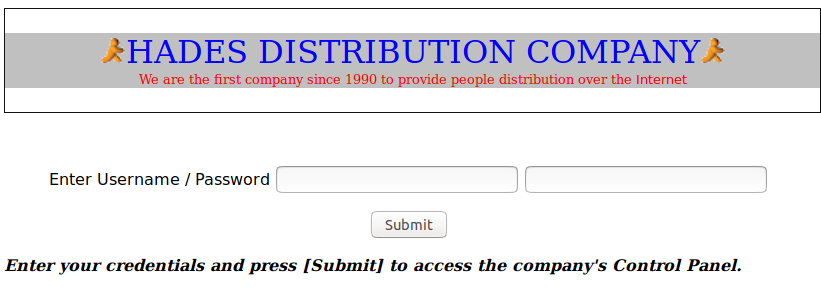
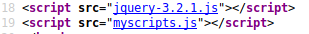

### Lernaean 



This means you should probably try to guess the password. Also make a habit of googling up anything in the challenge that you do not know. Googling up the challenge name brings up the following:


Turns out, THC Hydra is a tool to brute force logins. This is definitely a brute force challenge. You can read more on hydra on their [github page](https://github.com/vanhauser-thc/thc-hydra). Kali Linux comes with hydra pre-installed. (This is an excellent opportunity to experiment with different aspects of hydra.) The following command will get you the password  for the login:

```bash
$ hydra -l admin -P /usr/share/wordlists/rockyou.txt "http-post-form://88.198.233.174:49013/index.php:password=^PASS^:Invalid password!"
```

Once you log in with the acquired password, the following screen will appear. 



Wooh! What happened there? Look at the response to the post request to get the flag. 

### Cartographer



Username/Password login screen with no other information. SQL injection seems like the best bet. A cheat sheet for SQL injection is available [at this page](https://www.netsparker.com/blog/web-security/sql-injection-cheat-sheet/). Given the prevalence of this kind of vulnerability in challenges/web, more research is recommended. For this particular challenge, using ```' or 1=1--``` for both Username and password brings us to: 



The login must have worked as we are in the panel page. We are looking at the home info at the moment. Change that to ```info=flag```.

### HDC



A blank screen. The first instinct is to try look at the source, which reveals nothing else but:



All that second file has is a ```doProcess()``` function. The same function is present in the first file which reveal username and password. Once again, look at the source (the  source code has frame;  make sure to look at the whole code as it is rendered and not the specific frameset code). Snoop around for all the files. One of them has a hint on where to get the emails. Once you get the emails, send an email to everyone and check the response. One of them will give the flag. (The last part can be automated with BurpSuite Intruder).