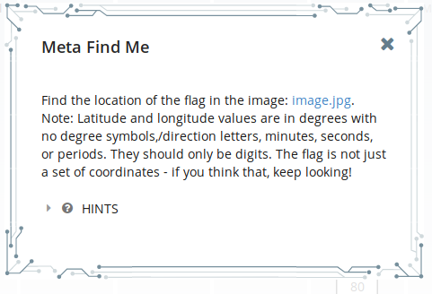
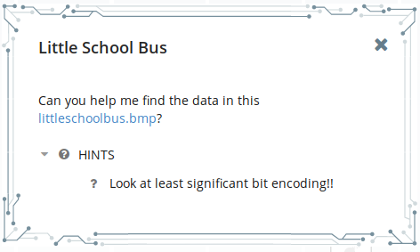
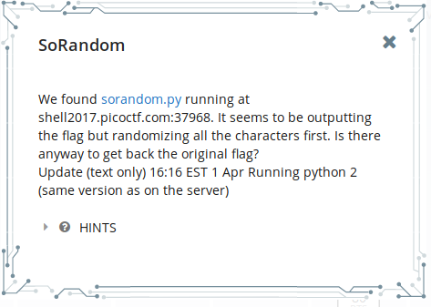

## Level 2

### Forensics

#### Meta Find Me



Since it's a meta challenge, let's get some look into the meta data.  

```bash
$ file image.jpg
image.jpg: JPEG image data, Exif standard: [TIFF image data, big-endian, direntries=8,
orientation=upper-left, xresolution=110, yresolution=118, resolutionunit=2,
software=Adobe Photoshop CS6 (Windows), datetime=2016:02:10 11:55:56, GPS-Data],
comment: ""Your flag is flag_2_meta_4_me_<lat>_<lon>_1c84. Now find the GPS coordinates
of this image! (", progressive, precision 8, 500x500, frames 3
```


Now we have some idea as to the flag from the comment. Now we need to find the latitude and longitude. One way to find the detailed metadata is:

```bash
$ identify -verbose image.jpg
Image: image.jpg
  Format: JPEG (Joint Photographic Experts Group JFIF format)
  Mime type: image/jpeg
    ...
  Properties:
    comment: "Your flag is flag_2_meta_4_me_<lat>_<lon>_1c84. Now find the GPS coordinates of this image! (Degrees only please)"
	...
    exif:GPSInfo: 218
    exif:GPSLatitude: 7/1, 0/1, 0/1
    exif:GPSLongitude: 100/1, 0/1, 0/1
    ...
```

Now I had to dig around a little to understand that format for the exact flag. As the problem says, the latitude and longitude  should be in degrees.

#### Little School Bus



Going on the previous challenge, I looked at the header. Neither ```file``` command nor `identify -verbose <file>` command was of any help. Then I looked into the hint. I googled around for `bmp files lsb encoding` and came across a blog that said the idea behind such steganography was to encode data in the last bit of data  bytes of the file. I wrote a python script to collect the last bits and print them as ASCII. Then I ran the script and searched for string `flag`.

```python
from bitarray import bitarray

# the encrypted byte may not start at the multiple of 8
for i in range(1, 8):
    s = bitarray()
    
    # open the file and collect lsb, one at a time
    with open('littleschoolbus.bmp', 'rb') as file:
        byte = file.read(i)
        while byte != b'':
            s.append(byte[-1] & 1)
            byte = file.read(1)
    
    # print out the collected lsb's as ASCII characters
    for c in s.tobytes():
        if c > 0 and c < 128:
            print(chr(c), end='')
# A more efficient program with play with bitarray
# to print handle the offset rather than reread the file.
# I left the original file to stay honest to how I
# actually solved it at the time.
```

### Cryptography

#### SoRandom



Let's have a look at the code at `sorandom.py`.

```python
#!/usr/bin/python -u
import random,string

flag = "FLAG:"+open("flag", "r").read()[:-1]
encflag = ""
random.seed("random")
for c in flag:
  if c.islower():
    #rotate number around alphabet a random amount
    encflag += chr((ord(c)-ord('a')+random.randrange(0,26))%26 + ord('a'))
  elif c.isupper():
    encflag += chr((ord(c)-ord('A')+random.randrange(0,26))%26 + ord('A'))
  elif c.isdigit():
    encflag += chr((ord(c)-ord('0')+random.randrange(0,10))%10 + ord('0'))
  else:
    encflag += c
print "Unguessably Randomized Flag: "+encflag

```

This is a simple shift cipher but the implementation is flawed. Since it has a fixed seed, the set of the random numbers generated will follow the same pattern every time. This can be broken by using a modified version of the same  program (see _Understanding Cryptography (Page 18)_ on how to solve shift ciphers in general). Let's get the ciphertext.

```bash
$ nc shell2017.picoctf.com 37968
Unguessably Randomized Flag: BNZQ:jn0y1313td7975784y0361tp3xou1g44
```

Now modify `sorandom.py` to solve this cipher:

```python
#!/usr/bin/python -u
import random,string

flag = BNZQ:jn0y1313td7975784y0361tp3xou1g44
encflag = ""
random.seed("random")
for c in flag:
  if c.islower():
    #rotate number around alphabet a random amount
    encflag += chr((ord(c)-ord('a')-random.randrange(0,26))%26 + ord('a'))
  elif c.isupper():
    encflag += chr((ord(c)-ord('A')-random.randrange(0,26))%26 + ord('A'))
  elif c.isdigit():
    encflag += chr((ord(c)-ord('0')-random.randrange(0,10))%10 + ord('0'))
  else:
    encflag += c
print "Unguessably Randomized Flag: "+encflag
```

