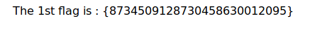
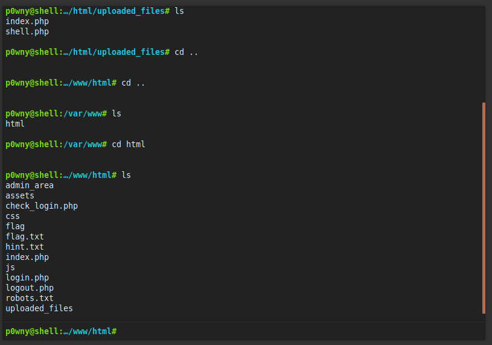

### Jordan Infosec CTF

##### Done in collaboration with [moni286](https://github.com/moni286)

The machine is available at [this vulnhub page](https://www.vulnhub.com/entry/jis-ctf-vulnupload,228/). Once the machine was downloaded and set up, the obvious first step was to use nmap. 

```sh
$ nmap -sC -sV -oA nmap/initial 192.168.56.101 
# Nmap 7.70 scan initiated Wed May 30 17:27:29 2018 as: nmap -sC -sV -oA nmap/initial 192.168.56.101
Nmap scan report for 192.168.56.101
Host is up (0.00015s latency).
Not shown: 998 closed ports
PORT   STATE SERVICE VERSION
22/tcp open  ssh     OpenSSH 7.2p2 Ubuntu 4ubuntu2.1 (Ubuntu Linux; protocol 2.0)
| ssh-hostkey: 
|   2048 af:b9:68:38:77:7c:40:f6:bf:98:09:ff:d9:5f:73:ec (RSA)
|   256 b9:df:60:1e:6d:6f:d7:f6:24:fd:ae:f8:e3:cf:16:ac (ECDSA)
|_  256 78:5a:95:bb:d5:bf:ad:cf:b2:f5:0f:c0:0c:af:f7:76 (ED25519)
80/tcp open  http    Apache httpd 2.4.18 ((Ubuntu))
| http-robots.txt: 8 disallowed entries 
| / /backup /admin /admin_area /r00t /uploads 
|_/uploaded_files /flag
|_http-server-header: Apache/2.4.18 (Ubuntu)
| http-title: Sign-Up/Login Form
|_Requested resource was login.php
MAC Address: 08:00:27:68:18:58 (Oracle VirtualBox virtual NIC)
Service Info: OS: Linux; CPE: cpe:/o:linux:linux_kernel

Service detection performed. Please report any incorrect results at https://nmap.org/submit/ .
# Nmap done at Wed May 30 17:27:36 2018 -- 1 IP address (1 host up) scanned in 7.07 seconds
```

As seen, there are a bunch of folders with restricted access on `robots.txt`. Because we saw the `/flag`, we checked it immediately and found:



The next obvious thing was to land on the home page and see the source code (also followed the random `js` and `css` link). Nothing was revealed. A few folders were non-existent. Others had empty front page. It took us the most time to get past this stage. I tried brute forcing `login` as well as the directory structure. SQL injection did not work.  Finally, we looked around a bit and found that we forgot to check the source code for `/admin_area` because it said:


However, when we finally got to it, the page source had:

```html
<html>
<head>
<title>
Fake admin area :)
</title>
<body>
<center><h1>The admin area not work :) </h1></center>
<!--	username : admin
	password : 3v1l_H@ck3r
	The 2nd flag is : {7412574125871236547895214}
-->
</body>
</html>
```

So we had the login screen. It asked to upload the file. Now the `uploaded_files` directory from nmap scan rang a bell. We uploaded a [`php shell`](https://github.com/flozz/p0wny-shell) and browsed to `/uploaded_files/shell.php` and voila, we were greeted by the shell.



At this point, we checked the hint.

```sh
$ cat hint.txt
try to find user technawi password to read the flag.txt file, you can find it in a hidden file ;)

The 3rd flag is : {7645110034526579012345670}
```

From here it took a while to find the other file but finally, the useful command was:

```sh
$ find / -user technawi
/etc/mysql/conf.d/credentials.txt
/var/www/html/flag.txt
/home/technawi
/home/technawi/.cache
/home/technawi/.bash_history
/home/technawi/.sudo_as_admin_successful
/home/technawi/.profile
/home/technawi/.bashrc
/home/technawi/.bash_logout
```

The content of the `/etc/mysql/conf.d/credentials.txt` is:

```tex
The 4th flag is : {7845658974123568974185412}

username : technawi
password : 3vilH@ksor
```

From here, we `ssh`ed into the machine as `technawi` and read the `flag.txt` file that was in 

`/var/www/html`. The file revealed the fifth flag.